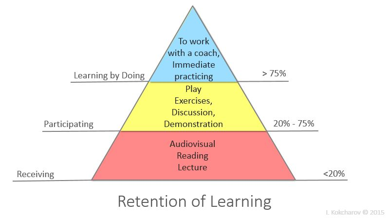

<section id="themes">
	<h2>Themes</h2>
		

			Set your presentation theme:  
			<!-- Hacks to swap themes after the page has loaded. Not flexible and only intended for the reveal.js demo deck. -->
                        <a href="#" onclick="document.getElementById('theme').setAttribute('href','css/theme/black.css'); return false;">Black (default)</a> -
			<a href="#" onclick="document.getElementById('theme').setAttribute('href','css/theme/white.css'); return false;">White</a> -
			<a href="#" onclick="document.getElementById('theme').setAttribute('href','css/theme/league.css'); return false;">League</a> -
			<a href="#" onclick="document.getElementById('theme').setAttribute('href','css/theme/sky.css'); return false;">Sky</a> -
			<a href="#" onclick="document.getElementById('theme').setAttribute('href','css/theme/beige.css'); return false;">Beige</a> -
			<a href="#" onclick="document.getElementById('theme').setAttribute('href','css/theme/simple.css'); return false;">Simple</a>  
			<a href="#" onclick="document.getElementById('theme').setAttribute('href','css/theme/serif.css'); return false;">Serif</a> -
			<a href="#" onclick="document.getElementById('theme').setAttribute('href','css/theme/blood.css'); return false;">Blood</a> -
			<a href="#" onclick="document.getElementById('theme').setAttribute('href','css/theme/night.css'); return false;">Night</a> -
			<a href="#" onclick="document.getElementById('theme').setAttribute('href','css/theme/moon.css'); return false;">Moon</a> -
			<a href="#" onclick="document.getElementById('theme').setAttribute('href','css/theme/solarized.css'); return false;">Solarized</a>
		

</section>

H:

# Visual Computing Introduction

Jean Pierre Charalambos

H:

# Outline

1. About <!-- .element: class="fragment" data-fragment-index="1"-->
2. Goal <!-- .element: class="fragment" data-fragment-index="2"-->
3. Course outline <!-- .element: class="fragment" data-fragment-index="3"-->
4. Methodology <!-- .element: class="fragment" data-fragment-index="4"-->
5. References <!-- .element: class="fragment" data-fragment-index="5"-->

H:

# About

Visual Computing
Jean Pierre Charalambos  
e-mail: jpcharalambosh@unal.edu.co  
[visual computing](https://github.com/visualcomputing)  
office: 120, Aulas de Ingeniería

H:

## Goal

>> To study the process of creation and manipulation of a digital image of a modern visual application, using current hardware

V:

## Goal

<section>
	<iframe width="420" height="345" src="https://www.youtube.com/embed/2hvprCbk1HU?start=122&end=167"></iframe>
</section>
Excerpt from Light Darkness And Colours documentary about Johann Wolfgang von Goethe Theory of Colors (1810).

H:

## Course outline

1. [free software](https://en.wikipedia.org/wiki/Free_software) *
2. [p5.js](https://p5js.org/)
3. [Static site generators](https://jamstack.org/generators/)
4. Cognitive aspects
5. Image processing & Fragment Shaders
6. Rendering & Algorithm visualization
7. Affine transformations & scene-graphs
8. Spline *
9. Interaction techniques
   1. Navigation / Picking & manipulation (Custom behaviors)
   2. Inverse kinematics *
10.  Lightning & Vertex Shaders
* to be defined

H:

## Methodology & grading
### Active (collaborative) learning

 <!-- .element height="400" -->  
[Learning Retention Pyramid](https://en.wikipedia.org/wiki/Active_learning)

V:

## Methodology & grading
### Active (collaborative) learning
               
    unaided        Zone of Proximal Development       with guidance
       |-----------------------> * <-----------------------|
               
V:

## Methodology & grading

* Presentations using [reveal.js](https://github.com/hakimel/reveal.js/)
  * Theory sessions
  * Practice sessions
* Workshops (research structure) using [gohugo](https://gohugo.io/) and [p5.js](https://p5js.org/)
  * Problem statement
  * Background
  * Code
  * Report -> [blog posts](https://en.wikipedia.org/wiki/Edublog)

H:

## References

1. [Online course](https://github.com/VisualComputing)
2. [Visualizing data](http://media.espora.org/mgoblin_media/media_entries/1633/Visualizing_Data.pdf)
3. [Math primer for graphics and game development](https://tfetimes.com/wp-content/uploads/2015/04/F.Dunn-I.Parberry-3D-Math-Primer-for-Graphics-and-Game-Development.pdf)
4. Papers
5. [songho](http://www.songho.ca/opengl/)
6. [scratchapixel](https://www.scratchapixel.com/)
